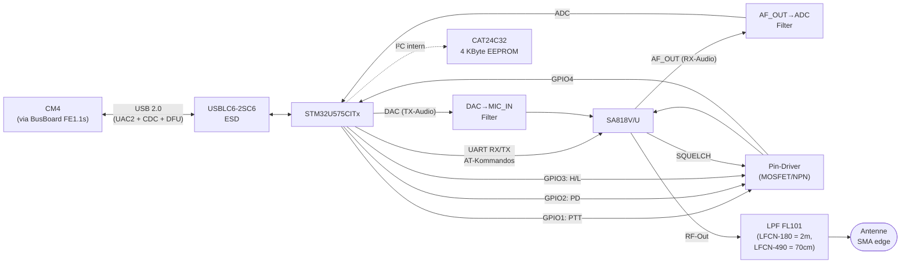

# FM Transceiver PCB

<table>
  <tr><th>Top</th><th>Bottom</th></tr>
  <tr>
    <td></td>
    <td></td>
  </tr>
</table>

## Übersicht

FM-Schmalband-Transceiver auf Basis des **SA818**-Moduls für die Amateurfunkbänder **2 m (144 – 174 MHz)** *oder* **70 cm (400 – 480 MHz)**. Bestückbar in beiden Varianten — abhängig vom verlöteten SA818-Chip (`SA818V` für VHF / `SA818U` für UHF) und dem dazu passenden Mini-Circuits-Tiefpassfilter (`LFCN-180` für VHF / `LFCN-490` für UHF; identischer FV1206-Footprint).

Zwischen SA818 und CM4 sitzt ein **STM32U575** Mikrocontroller. Er stellt sich am USB als **Composite Device** vor und sieht für das CM4-Linux aus wie:

- **UAC2** (USB Audio Class 2) — TX-Audio strömt vom CM4 als Audio-Sink in den STM32-DAC und von dort als analoges Signal zum SA818-Mic-Input. RX-Audio läuft umgekehrt: SA818-AF_OUT → STM32-ADC → über UAC2 als Audio-Source zurück ans CM4.
- **CDC ACM** (Virtual COM Port) — PTT, Squelch-Read, Frequenz, Power-Level usw. werden vom CM4 als ASCII-Kommandos über `/dev/ttyACM*` gesetzt.
- **DFU** (Device Firmware Upgrade) — STM32-Firmware kann über USB neu geflasht werden, ohne SWD-Adapter und ohne BOOT0-Hardware-Jumper.

Das Modul belegt einen der vier Slots auf dem [BusBoard](../HW-Module-BusBoard/). Die Kommunikation zum CM4 läuft **ausschließlich über USB** (USB-Pair am Bus-Stecker, durch den FE1.1s-Hub auf dem BusBoard); I²C, UART und GPIO-Pins des Bus-Steckers sind NICHT genutzt.

## Block-Diagramm

## Band-Varianten

Die Platine ist für beide Amateurfunk-Bänder ausgelegt; bestückungsabhängig:

| Variante | SA818-Chip | LPF-Bestückung (FL101) | Band |
| -------- | ---------- | ---------------------- | ---- |
| **2 m / VHF** | `SA818V` | `LFCN-180` | 144 – 174 MHz |
| **70 cm / UHF** | `SA818U` | `LFCN-490` | 400 – 480 MHz |

Es gibt nur **einen einzigen Filter-Footprint** (FL101 — Mini-Circuits FV1206) auf der Platine. Je nach SA818-Bestückung wird das passende LFCN-Bauteil eingelötet.

⚠️ **Wichtig**: SA818-Chip und LPF-Bestückung müssen zueinander passen. Ein falsch bestückter Filter unterdrückt entweder das Nutzband oder lässt zu viele Oberwellen durch → Empfangsperformance schlecht und/oder Verstoß gegen Spektrumvorschriften.

## Steckverbinder

| Bezeichner | Typ | Funktion |
| ---------- | --- | -------- |
| **J101** | Board-Edge SMA | Antennenanschluss (50 Ω) |
| **J201** | 10-Pin 2.54 mm Stiftleiste 2×5 horizontal (right-angle) | STM32-Programming- und Debug-Header (SWD-Pin-Belegung) |
| **J202** | 20-Pin (Hirose **PCN10C-20S-2.54DS** — weibliche Buchse, paart mit dem PCN10-20P-Stift-Header auf dem BusBoard) | Bus-Stecker zum [BusBoard](../HW-Module-BusBoard/) |
| **JP201** | 2× Lötpad | EEPROM-Write-Protect-Brücke (siehe „EEPROM" unten) |

### Bus-Stecker J202 (FM-Slot-Sicht)

Das FM-Modul ist ein Device-Slot-Konsument. Power-Belegung identisch zu allen anderen Slots; nur USB ist aktiv, alle anderen Slot-Signal-Pins (`a7`–`a9`, `b7`–`b9`) sind NC.

| Pin | Net | Pin | Net |
|----:|-----|----:|-----|
| a1  | +12V | b1  | +12V |
| a2  | +12V | b2  | +12V |
| a3  | GND  | b3  | GND  |
| a4  | +5V  | b4  | +5V  |
| a5  | +5V  | b5  | +5V  |
| a6  | USB D+ | b6 | USB D− |
| a7  | NC   | b7  | NC   |
| a8  | NC   | b8  | NC   |
| a9  | NC   | b9  | NC   |
| a10 | GND  | b10 | GND  |

Hinweis: Pin-Numerierung am FM-Modul ist **gespiegelt** ggü. dem BusBoard-Slot (FM `a1` ↔ BusBoard `a10` usw.) — physikalisch passt's. Kanonische Bus-Pinbelegung siehe [BusBoard](../HW-Module-BusBoard/#pin-belegung-20-pin-identisch-auf-allen-konnektoren).

### STM32 SWD-Header J201

10-Pin 2.54-mm-Stiftleiste (2×5, right-angle/horizontal). Pin-Belegung folgt der SWD-Konvention, der Stecker selbst ist aber **kein** Cortex-Debug-1.27-mm-Standard — Adapter-Kabel für 2.54 mm benötigt, oder Jumper-Litzen direkt auf die einzelnen Pins.

| Pin | Signal | Pin | Signal |
|----:|--------|----:|--------|
| 1 | +3V3   | 2 | SWDIO   |
| 3 | GND    | 4 | SWCLK   |
| 5 | GND    | 6 | NC      |
| 7 | NC     | 8 | NC      |
| 9 | GND    | 10 | nRESET |

**Pin-1-Lage im Silkscreen ist auf der aktuellen Revision NICHT markiert** ([Issue #13](https://github.com/OE5XRX/HW-Module-FMTransceiver/issues/13)) — Schaltplan zur Hand nehmen oder die Pin-1-Markierung vom Programmer-Kabel mit einem Multimeter gegen `+3V3` verifizieren.

## STM32 ↔ SA818 — Steuersignal-Mapping

Die STM32-GPIOs steuern das SA818 über Level-Shifter (MOSFET / NPN — `pin_driver` und `pin_driver_npn` Sub-Sheets):

| Funktion | Schaltplan-Label | STM32-Pin (LQFP-48) | SA818-Pin | Richtung |
| -------- | ---------------- | ------------------- | --------- | -------- |
| **PTT** (Push-to-Talk) | `GPIO1` | `PB2` (Pin 20) | `~PTT` (Pin 5) | STM32 → SA818 |
| **POWER_DOWN** (Modul ein/aus) | `GPIO2` | `PB1` (Pin 19) | `~PD` (Pin 6) | STM32 → SA818 |
| **H_L_Power** (Sendeleistung high/low) | `GPIO3` | `PB10` (Pin 21) | `H/L` (Pin 7) | STM32 → SA818 |
| **SQUELCH** (Squelch-Open-Indikator) | `GPIO4` | `PB0` (Pin 18) | `~SQ` (Pin 1) | SA818 → STM32 |

Zusätzlich UART auf STM32 USART_TX/USART_RX ↔ SA818 für AT-Kommandos (Frequenz setzen, Modulation, CTCSS, etc. — siehe SA818-Datenblatt).

## Firmware-Rolle (STM32U575)

Die STM32-Firmware (Quelle: [`FW-RemoteStation`](https://github.com/OE5XRX/FW-RemoteStation)) macht aus dem FM-Modul ein selbst beschreibendes USB-Gerät am CM4:

| USB-Klasse | Zweck | CM4-Sicht |
| ---------- | ----- | --------- |
| **UAC2** | Audio-Class 2 für TX- und RX-Audio | Sound-Karte: aufnehmen vom Modul (RX-Audio) und abspielen zum Modul (TX-Audio) per ALSA/PipeWire. |
| **CDC ACM** | Kontroll-Pfad | `/dev/ttyACM*` — ASCII-Kommandos für PTT, Squelch-Read, Frequenz, Power-Level. |
| **DFU** | Firmware-Update | `dfu-util` kann die STM32-FW über USB neu schreiben — **kein BOOT0-Pin-Eingriff nötig**, die laufende Firmware switcht über CDC-Kommando in den DFU-Mode. |

Audio läuft vollständig analog zwischen SA818 und STM32 (DAC/ADC im STM32) — keine Echtzeit-Anforderungen am CM4-Linux nötig, Audio wird als regulärer USB-Audio-Stream behandelt.

## Auf der Platine verbaute Komponenten

| Bauteil | Funktion |
| ------- | -------- |
| **SA818V / SA818U** (U101) | FM-Schmalband-Transceiver-Modul (1 W TX-Leistung). Bestückung je nach Band. |
| **STM32U575CITx** (U201) | Cortex-M33 USB-Bridge. UAC2 + CDC + DFU Composite Device. |
| **TLV73333PQDBVRQ1** (U203) | Automotive-grade (-Q1) 3.3 V LDO — Versorgung für STM32 + Peripherie. |
| **USBLC6-2SC6** (U204) | USB-ESD-Schutz auf den D±-Leitungen vor STM32. |
| **CAT24C32** (U202) | 32 Kbit (4 KByte) I²C EEPROM. WP-Pin über `JP201`-Lötbrücke konfigurierbar. |
| **LMR51430** (U801) | Buck-Konverter 12 V → 5 V für die SA818-Versorgung. |
| **LFCN-180** *oder* **LFCN-490** (FL101) | Mini-Circuits Tiefpass im Antennen-Pfad (Oberwellen-Unterdrückung). Eines der beiden wird in den FV1206-Footprint bestückt — `LFCN-180` für 2 m, `LFCN-490` für 70 cm. |
| **8 MHz Crystal** | Taktquelle für den STM32U575 (Backup zum HSI). |
| **Pin Driver** (pin_driver / pin_driver_npn Sub-Sheets) | MOSFET- und NPN-Level-Shifter zwischen STM32-3.3-V-GPIOs und SA818. |

## EEPROM (CAT24C32)

4-KByte-EEPROM am internen I²C-Bus des STM32 (separate I²C-Lines `I2C_SCL_MEM`/`I2C_SDA_MEM` von Pin 45/46 — also nicht über den Bus zum CM4 erreichbar). **Vorgesehen für Modul-Konfiguration** (Seriennummer, Kalibrierdaten, gespeicherte Frequenzlisten o.ä.). **Aktuell noch leer** — Firmware definiert das Schema noch.

**Write-Protect** über `JP201` (zwei Lötpads, KEIN Pin-Header):

| JP201 | Verhalten |
| ----- | --------- |
| **offen** (Default ab JLCPCB) | EEPROM beschreibbar — STM32 kann CAT24C32 lesen UND schreiben. |
| **gebrückt** (Lötzinn-Brücke) | EEPROM schreibgeschützt (CAT24C32 Pin 7 / WP = high). Nur Lesen möglich. |

In der Endmontage (Produktivbetrieb) ist es empfehlenswert die Brücke zu setzen, damit kein Firmware-Bug versehentlich Kalibrierdaten überschreibt.

## Versorgung

| Rail | Quelle | Verbrauch |
| ---- | ------ | --------- |
| +12V | Bus-Stecker (vom [PowerBoard](../HW-Module-PowerBoard/)) | < 1 A (SA818 TX-Spitze) |
| +5V  | Lokaler LMR51430 Buck aus +12V | für SA818 |
| +3V3 | Lokaler TLV73333-Q1 LDO aus +5V | für STM32, EEPROM, Pin-Driver-Logik |

Hinweis: das Modul nutzt sowohl die +12V- *als auch* die +5V-Schiene vom Bus — die +5V vom Bus speist die USB-Interface-Schaltung (USBLC6), während die SA818-Versorgung lokal aus den +12V gezogen wird (saubere Trennung von Audio/Digital und HF/Switching-Noise).

## Bestückung

- **SA818** und passender **LFCN-Filter** müssen zusammenpassen — siehe Band-Varianten-Tabelle oben. Bei JLCPCB-Order entsprechende Variant-Auswahl im KiBot-Setup.
- **`JP201`-Lötbrücke** wird ab Werk **offen** geliefert (EEPROM beschreibbar zur Initialkonfiguration). Brücke kann nach Konfiguration mit Lötzinn geschlossen werden.
- Antenne: **Niemals senden ohne Antenne oder 50-Ω-Dummy-Last** am SMA — das SA818 verträgt offene/kurzgeschlossene Antennen-Ports nicht und kann beschädigt werden.

## Bringup

Nach Bestückung (mit Bus + CM4 verbunden):

1. **Power-Sanity:** Modul in Slot stecken, +12 V anlegen, am Bus-Stecker `+5V`-Pin gegen GND messen → 5.00 ± 0.05 V (LMR51430-Output). `+3V3` (z.B. am SWD-Header J201 Pin 1 vs Pin 3) muss 3.30 ± 0.05 V zeigen.
2. **STM32-Boot:** kurze Latenz nach Power-Up sollte am USB ein Composite Device erscheinen (`lsusb -v` am CM4). Drei USB-Interfaces sind erwartet: UAC2 (Audio), CDC ACM (Serial), DFU-Runtime.
3. **Soundkarten-Check:** `aplay -L` / `arecord -L` am CM4 → die FM-Module-UAC2-Soundkarte muss in der Liste sein.
4. **CDC-Konsole:** `screen /dev/ttyACM0 115200` (oder welche Nummer auch immer) — Firmware-spezifisches Prompt/Echo erwartet.
5. **SA818-Smoke:** über CDC-Kommando Frequenz setzen, dann mit Funkscanner / SDR auf der eingestellten Frequenz Trägeraussendung kurz testen (5-Sek-Burst max, **mit Antenne!**).
6. **Firmware-Update-Pfad:** über CDC-Kommando in DFU schalten, mit `dfu-util -l` muss das Modul auftauchen — bestätigt dass auch Firmware-Updates über reines USB möglich sind, ohne SWD-Programmer.

## Verwandte Module

- [BusBoard](../HW-Module-BusBoard/) — stellt USB-Anbindung über FE1.1s-Hub bereit.
- [PowerBoard](../HW-Module-PowerBoard/) — speist +12 V / +5 V am Bus.
- [CM4 Carrier](../HW-Module-CM4Carrier/) — USB-Host und Software-Endpoint für UAC2/CDC/DFU.
- [`FW-RemoteStation`](https://github.com/OE5XRX/FW-RemoteStation) — STM32-Firmware-Quellcode.

## Daten

- [Schaltplan]({{ site.data.project.name }}-schematic.pdf)
- [BOM]({{ site.data.project.name }}-bom.html)
- [iBOM]({{ site.data.project.name }}-ibom.html)
- [JLCPCB fabrication & stencil](JLCPCB/{{ site.data.project.name }}-_JLCPCB_compress.zip)
- [JLCPCB Bom](JLCPCB/{{ site.data.project.name }}_bom_jlc.csv)
- [JLCPCB Pick&Place](JLCPCB/{{ site.data.project.name }}_cpl_jlc.csv)
